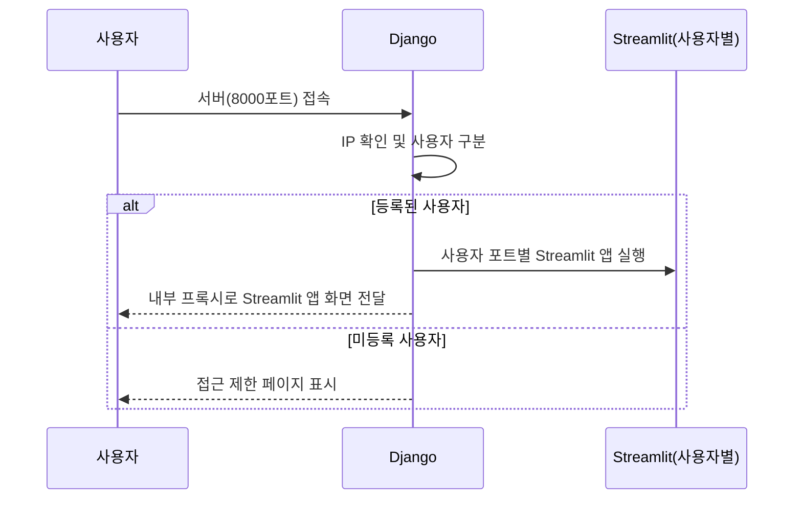

# Django-Streamlit 연동 방식을 핵심 중심으로 정리

프로젝트 팀 공유용으로 전체적인 서버 관리 방안과 Django-Streamlit 연동 방식을 핵심 중심으로 정리하였습니다.

---

# **5G Feature Manager 프로젝트**

### **서버 운영 및 관리 방안 (최종)**

---

## **1. 프로젝트 구성 및 목표**

기존 로컬 기반의 **5G Feature 관리 도구**를 웹 기반(Django+Streamlit)으로 전환하여:

- 사용자 접근성 증대 및 관리 편의성 향상
    
- 보안성 강화(IP 기반 사용자 인증)
    
- 사용자별 독립된 프로세스 관리로 서버 자원 최적화
    

---

## **2. 서버 구성 방식**

### **① Django 서버 (Main Server)**

- IP 기반 사용자 인증 및 접근 권한 관리
    
- 서버 부하 모니터링, 사용자 접속 통계 관리
    
- 관리자 전용 페이지 제공
    
- Streamlit 앱 접근을 위한 내부 프록시 기능 수행
    

### **② Streamlit 앱**

- 사용자별 독립된 프로세스로 실행 (개별 포트 할당)
    
- 데이터 처리, JSON 파일 생성, 시각화 기능 수행
    
- 내부(localhost)로만 접근 허용 (외부 직접 접근 차단)
    

---

## **3. 사용자 접근 관리 (IP 기반)**

|사용자 유형|접근 권한|접속 방식|Streamlit 포트 예시|
|---|---|---|---|
|관리자|전체 접근 가능|Django → 관리자 페이지 → Streamlit 앱|8500|
|일반 사용자|제한적 접근 (Streamlit 앱만 접근)|Django → 즉시 Streamlit 앱 연결|8501, 8502, ...|
|미등록 사용자|접근 제한|Django → 접근 제한 페이지|없음|

**Django에서 IP 확인 후 자동 리다이렉트 구조로 동작합니다.**

---

## **4. 세션 관리 방식**

### (1) Django 세션

- 쿠키 기반으로 관리
    
- 브라우저 종료 또는 장기 미접속 시 만료
    

### (2) Streamlit 세션

- 앱이 열린 동안만 유지
    
- 브라우저 종료 시 모든 상태 초기화 (데이터 유지 필요 시 DB 저장 방식 권장)
    

---

## **5. 서버 부하 및 모니터링 관리**

### 주요 관리 항목

- 서버 CPU, 메모리 사용률 실시간 모니터링 (psutil 활용)
    
- 사용자 접속 횟수, 일/주간 통계 관리
    
- 각 사용자 세션별 체류 시간 측정 및 관리
    
- 관리자 페이지(Django Admin)에서 직관적 관리 제공
    

---

## **6. Django-Streamlit 연동 구조**

**특징:**

- 사용자는 Streamlit 앱에 직접 접근하지 않고 Django를 통해서만 접근 (보안성 강화)
    
- 사용자별로 별도의 Streamlit 앱 프로세스가 독립적으로 실행됨
    

---

## **7. 서버 보안 및 권장 사항**

|항목|현재 상태|권장 조치|
|---|---|---|
|SSL/TLS(HTTPS) 적용|미적용|반드시 SSL 인증서 도입|
|IP 인증 보안 강화|IP 인증만 사용|추가 인증 절차(비밀번호 등) 권장|
|관리자 계정 보호|기본 Admin 사용|강력한 비밀번호 설정 및 URL 변경|
|외부 접근 방화벽 설정|미설정|Windows 방화벽 활용 외부 접근 차단 필수|
|최신 소프트웨어 관리|진행 중|정기적 보안 업데이트 필수|

---

## **8. 서버 운영 환경 (Windows)**

### 권장 운영 방안:

- Windows 작업 스케줄러 또는 NSSM을 이용하여 Django 서버 24시간 자동 실행 유지
    
- Streamlit 앱은 Django가 자동으로 실행/종료 관리
    
- 정기적(매주/매월) 서버 상태 점검 및 백업 관리 진행
    

---

## **9. CI/CD 및 코드 품질 관리**

- GitHub Actions를 통해 자동화된 Lint/테스트 수행
    
- 주요 기능 업데이트 시 코드 리뷰 필수 진행
    

---

## **10. 주요 구현 일정 및 향후 계획**

|단계|상태|내용|
|---|---|---|
|POC 평가|✅ 완료|기술적 가능성 평가 완료|
|MVP 개발|⚠️ 진행 중|현재 핵심 기능 개발 및 테스트 중|
|사용자 테스트|❌ 예정|사용자 피드백 반영 및 안정화|
|제품 최적화|❌ 예정|성능 및 보안 최적화|
|내부 배포|🚀 예정|내부 서버 배포 후 팀 교육 진행|
|유지보수|❌ 예정|지속적인 모니터링 및 업데이트|

---

### 📌 **핵심 사항**

1. **사용자별 독립 프로세스 관리**(개별 Streamlit 포트 사용)는 서버 안정성 확보에 매우 효과적입니다.
    
2. Django는 사용자의 IP 기반 인증과 접근 관리, 서버 부하 모니터링 및 통계를 효율적으로 관리합니다.
    
3. 보안 강화를 위해 SSL 인증서 적용 및 추가 인증 절차를 반드시 검토 및 도입합니다.
    
4. Streamlit 앱은 외부에서 직접 접근하지 않고 Django 서버를 통해서만 접근 가능합니다.
    
5. 서버 관리와 모니터링은 관리자 페이지에서 상시 진행하며, 이상 징후가 발견되면 즉시 공유 및 대응합니다.
    

---

추가적으로 필요한 사항이나 의견은 언제든지 공유 부탁드립니다!
